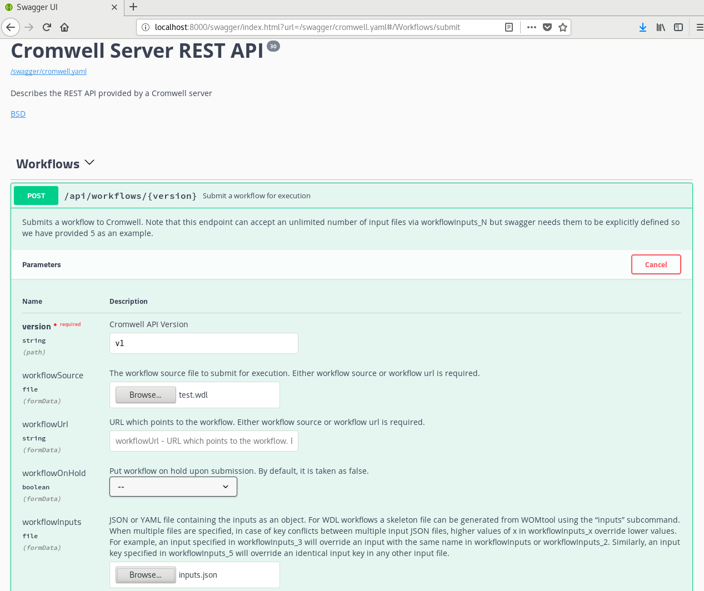

# Data Sciences Platforms


***


## Comparisons

- Platforms / Frameworks
    - [Simple comparison of Snakemake, Nextflow and Cromwell/WDL](https://github.com/grst/snakemake_nextflow_wdl)
    - [Which Bioinformatic Friendly Pipeline Building Framework?](https://www.biostars.org/p/91301/)
    - Leipzig, Jeremy. “A Review of Bioinformatic Pipeline Frameworks.” Briefings in Bioinformatics 18, no. 3 (May 1, 2017): 530–36. [https://doi.org/10.1093/bib/bbw020](https://doi.org/10.1093/bib/bbw020).
    - Krishnan, Vandhana, Sowmithri Utiramerur, Zena Ng, Somalee Datta, Michael P. Snyder, and Euan A. Ashley. “Benchmarking Workflows to Assess Performance and Suitability of Germline Variant Calling Pipelines in Clinical Diagnostic Assays.” BMC Bioinformatics 22, no. 1 (February 24, 2021): 85. [https://doi.org/10.1186/s12859-020-03934-3](https://doi.org/10.1186/s12859-020-03934-3).
    - Jackson, Michael, Kostas Kavoussanakis, and Edward W. J. Wallace. “Using Prototyping to Choose a Bioinformatics Workflow Management System.” PLOS Computational Biology 17, no. 2 (February 25, 2021): e1008622. [https://doi.org/10.1371/journal.pcbi.1008622](https://doi.org/10.1371/journal.pcbi.1008622).


***


## Converters

- [Converter from the Broad Institute's Workflow Definition Language (WDL) to the Common Workflow Language](https://www.espressoman.online/common-workflow-language/wdl2cwl)


***


# SMK: Snakemake

The [Snakemake](https://snakemake.readthedocs.io/en/stable/) workflow management system is a tool to create reproducible and scalable data analyses. Workflows are described via a human readable, Python based language. They can be seamlessly scaled to server, cluster, grid and cloud environments, without the need to modify the workflow definition.

> Mölder, Felix, Kim Philipp Jablonski, Brice Letcher, Michael B. Hall, Christopher H. Tomkins-Tinch, Vanessa Sochat, Jan Forster, et al. “Sustainable Data Analysis with Snakemake.” F1000Research 10 (January 18, 2021): 33. [https://doi.org/10.12688/f1000research.29032.1](https://doi.org/10.12688/f1000research.29032.1).

## Issues

- TBC

***


## Resources

- [Snakemake](https://snakemake.github.io/)
- [Snakemake Documentation](https://snakemake.readthedocs.io/en/stable/tutorial/tutorial.html#tutorial)
- [snakemake-workflows](https://github.com/snakemake-workflows)
- [snakemake/snakemake-wrappers](https://github.com/snakemake/snakemake-wrappers)
  - [The Snakemake Wrappers repository](https://snakemake-wrappers.readthedocs.io/en/stable/)


***


## Tips

- TBC

***


## Setting


***


### Requirements


***


### Installation

```bash
conda create -c conda-forge -c bioconda -n snakemake snakemake
```

***


### Concepts / Syntax

***


### Hello World!!

- [Snakefile-hello_world.smk](https://github.com/wenching/DataSciencesPlatforms/blob/master/snakemake/hello_world/Snakefile-hello_world.smk)

```bash
snakemake --use-conda --cores 2 --snakefile Snakefile-hello_world.smk
```

***


### snakemake-tutorial

```bash
cd ~/Desktop/Sync/Natera/GitHub/DataSciencesPlatforms/snakemake/snakemake-tutorial
git clone https://github.com/snakemake/snakemake-tutorial-data.git

conda activate snakemake
conda install -c bioconda bwa -y
conda install -c bioconda samtools -y
conda install -c bioconda sambamba -y
```

***


# WDL: Workflow Description Language

a workflow language meant to be read and written by humans.


(Adapted from the BioCentric)


## Issues
- [read_json does not work on Array\[Struct\] #4219](https://github.com/broadinstitute/cromwell/issues/4219)


## Resources
- [Toolkits for WDL](https://software.broadinstitute.org/wdl/toolkit)
- [WDL User Guide](https://software.broadinstitute.org/wdl/documentation/)
    - [Quick Start Guide](https://software.broadinstitute.org/wdl/documentation/quickstart)
    - [Real Workflows](https://software.broadinstitute.org/wdl/documentation/topic?name=wdl-scripts)
        - [WDL workshops](https://drive.google.com/drive/folders/0BwTg3aXzGxEDR2QxOEROZDRIcEE)
    - [The full, formal WDL language specification](https://software.broadinstitute.org/wdl/documentation/spec) | [Markdown version](https://github.com/openwdl/wdl/blob/develop/SPEC.md)
    - [Tutorial](https://software.broadinstitute.org/wdl/documentation/topic?name=wdl-tutorials)
        - [(howto) Install software for WDL workshops](https://software.broadinstitute.org/wdl/documentation/article?id=9434)
        - [(howto) WDL for GATK](https://software.broadinstitute.org/wdl/documentation/topic?name=wdl-tutorials)
            - [WDL tutorial - helloHaplotypeCaller.zip](https://drive.google.com/file/d/0B7akc6CTmxIHdy11R1M3ZjJJdUU)
            - [WDL tutorial data](https://drive.google.com/drive/folders/18tjkWNjm7YTD9Bf8gBfTROtqC3Y2bM1J)
- [Workflow Object Model (WOM)](https://cromwell.readthedocs.io/en/develop/WOMtool/)
- Cromwell
    - [cromwell](https://cromwell.readthedocs.io/en/develop/)
    - [Five Minute Intro](https://cromwell.readthedocs.io/en/develop/tutorials/FiveMinuteIntro/)
- [Cromweller](https://github.com/ENCODE-DCC/cromweller) is a wrapper Python package for Cromwell
-Advanced
    - [Problem parsing interval list file to GenomicsDBImport in GATK4](https://www.biostars.org/p/289822/) | [GATK Forum](https://gatkforums.broadinstitute.org/gatk/discussion/10973/problem-parsing-interval-list-file-to-genomicsdbimport)
        - application.conf


***


## Tips

- [WDL syntax error in comment still reported as an error](https://github.com/broadinstitute/cromwell/issues/2870)


## Setting

- Check Java version (at least version 8)
    
    ```console
    [wenching@localhost WDL]$ java -version
    openjdk version "1.8.0_212"
    OpenJDK Runtime Environment (build 1.8.0_212-b04)
    OpenJDK 64-Bit Server VM (build 25.212-b04, mixed mode)
    ```
     
- Check individual tools
    - [wdltool.jar](https://github.com/broadinstitute/wdltool/releases) is now called [womtool.jar](https://github.com/broadinstitute/cromwell/releases)
        
        ```console
        [wenching@localhost WDL]$ java -jar womtool.jar --help
        womtool 41
        Usage: java -jar womtool.jar [validate|inputs|parse|highlight|graph|upgrade|womgraph] [options] workflow-source
        
          workflow-source          Path to workflow file.
          -i, --inputs <value>     Workflow inputs file.
          -h, --highlight-mode <value>
                                   Highlighting mode, one of 'html', 'console' (used only with 'highlight' command)
          -o, --optional-inputs <value>
                                   If set, optional inputs are also included in the inputs set. Default is 'true' (used only with the inputs command)
          --help                   
          --version                
        
        Command: validate
        Validate a workflow source file. If inputs are provided then 'validate' also checks that the inputs file is a valid set of inputs for the workflow.
        
        Command: inputs
        Generate and output a new inputs JSON for this workflow.
        
        Command: parse
        (Deprecated; WDL draft 2 only) Print out the Hermes parser's abstract syntax tree for the source file.
        
        Command: highlight
        (Deprecated; WDL draft 2 only) Print out the Hermes parser's abstract syntax tree for the source file. Requires at least one of 'html' or 'console'
        
        Command: graph
        Generate and output a graph visualization of the workflow in .dot format
        
        Command: upgrade
        Automatically upgrade the WDL to version 1.0 and output the result.
        
        Command: womgraph
        (Advanced) Generate and output a graph visualization of Cromwell's internal Workflow Object Model structure for this workflow in .dot format
        ```
        
        ```console
        [wenching@localhost WDL]$ java -jar wdltool.jar --help
        
        java -jar wdltool.jar <action> <parameters>
        
        Actions:
        validate <WDL file>
        
          Performs full validation of the WDL file including syntax
          and semantic checking
        
        inputs <WDL file>
        
          Print a JSON skeleton file of the inputs needed for this
          workflow.  Fill in the values in this JSON document and
          pass it in to the 'run' subcommand.
        
        highlight <WDL file> <html|console>
        
          Reformats and colorizes/tags a WDL file. The second
          parameter is the output type.  "html" will output the WDL
          file with <span> tags around elements.  "console" mode
          will output colorized text to the terminal
        
        parse <WDL file>
        
          Compares a WDL file against the grammar and prints out an
          abstract syntax tree if it is valid, and a syntax error
          otherwise.  Note that higher-level AST checks are not done
          via this sub-command and the 'validate' subcommand should
          be used for full validation.
        
        graph <WDL file>
        
          Reads a WDL file against the grammar and prints out a
          .dot of the DAG if it is valid, and a syntax error
          otherwise.
        
        womgraph <WDL or CWL file> [ancillary files]
        
          Reads a WDL or CWL file from the first argument and
          converts it to a WOM representation then prints out a graph
          of the WOM produced.
          Any imported files can be supplied as subsequent arguments.
        ```
        
    - [cromwell.jar](https://github.com/broadinstitute/cromwell/releases): Workflow Management System
        
        ```console
        [wenching@localhost WDL]$ java -jar cromwell.jar --help
        cromwell 41
        Usage: java -jar /path/to/cromwell.jar [server|run|submit] [options] <args>...
          --help                   Cromwell - Workflow Execution Engine
          --version                
        Command: server
        Starts a web server on port 8000.  See the web server documentation for more details about the API endpoints.
        Command: run [options] workflow-source
        Run the workflow and print out the outputs in JSON format.
          workflow-source          Workflow source file or workflow url.
          --workflow-root <value>  Workflow root.
          -i, --inputs <value>     Workflow inputs file.
          -o, --options <value>    Workflow options file.
          -t, --type <value>       Workflow type.
          -v, --type-version <value>
                                   Workflow type version.
          -l, --labels <value>     Workflow labels file.
          -p, --imports <value>    A directory or zipfile to search for workflow imports.
          -m, --metadata-output <value>
                                   An optional directory path to output metadata.
        Command: submit [options] workflow-source
        Submit the workflow to a Cromwell server.
          workflow-source          Workflow source file or workflow url.
          --workflow-root <value>  Workflow root.
          -i, --inputs <value>     Workflow inputs file.
          -o, --options <value>    Workflow options file.
          -t, --type <value>       Workflow type.
          -v, --type-version <value>
                                   Workflow type version.
          -l, --labels <value>     Workflow labels file.
          -p, --imports <value>    A directory or zipfile to search for workflow imports.
          -h, --host <value>       Cromwell server URL.
        ```


***


## Syntax

```console
# import all tasks externally stored in other wdl files
# import "OTHER.wdl" as OTHER_wdl
## import "https://api.firecloud.org/ga4gh/v1/tools/broadinstitute_gtex:star_v1-0_BETA/versions/3/plain-WDL/descriptor" as star_wdl

workflow WORKFLOW {
  # (workflow-level) variable decalaration
  ## Array[Array[File]] sub_fastq
  ## Int? outFilterMultimapNmax
  ## Int fastqs_len = length(sub_fastq)
  ## Map[String, String] restriction_enzyme_to_site = read_map("workflow/restriction_enzyme_to_site.tsv")
  ## String ligation_site = restriction_enzyme_to_site[restriction_enzyme]
  
  # Task Aliasing
  call [TASK_wdl].TASK_1_LONG_NAME AS TASK_1 { # [TASK_wdl] if TASK was externally stored and imported in the begining as a conventional name
    input: TASK_VARIABLE = WORKFLOW_VARIABLE|TASK.OUT_VARIABLE[, 
           TASK_VARIABLE = WORKFLOW_VARIABLE|TASK.OUT_VARIABLE]
  }
  
  ## Array[File] collisions = fragment.collisions  #for separate user entry point
  ## Array[File] collisions_low = fragment.collisions_low_mapq
  ## Array[Array[File]] bams_to_merge = [collisions, collisions_low, unmapped, mapq0, alignable]
  
  # Linear Chaining
  call TASK_2 {
    input: TASK_2_in = TASK_1.out
  }
  call TASK_3 {
    input: TASK_3_in = TASK_2.out
  }
  
  # Multi-in/out
  call TASK_2 {
    input: TASK_2_in = TASK_1.out
  }
  call TASK_3 {
    input: TASK_3_in_1 = TASK_2.out_1,
           TASK_3_in_2 = TASK_2.out_2
  }
  
  # Branch/Merge
  Array[File] workflowArrayBranchResult
  
  call TASK_1 {
    input: TASK_1_in = workflowIn
  }
  
  call TASK_2 {
    input: TASK_2_in = workflowIn
  }
  
  workflowArrayBranchResult = [TASK_1.out, TASK_2.out]
  
  call TASK_3 {
    input: TASK_3_in = workflowArrayBranchResult
  }
  
  
  # Scatter-Gather Parallelism
  Array[File] workflowInputFiles
  
  scatter (inFile in workflowInputFiles) {
    call TASK_1 {
      input: TASK_1_in = inFile # explicit scatter calls
    }
  }
  call TASK_2 {
    input: TASK_2_in = TASK_1.out # implicit gather argument assignment
  }
}

task TASK {
  # (task-level) variable decalaration
  
  # '#' will raise an unexpected error when using 'command { ... }'
  command {
    bala \
    bala
    
    # java -jar $GATK --help
  }
  
  # Or,
  
  # 'command <<< ... >>>' can recognize '#' as a comment character
  command <<<
    set -euo pipefail
    
    bala
    
    ## readlink -f ${wdir}*.gvcf.gz > file_names.txt
    ## /src/run_TASK_wrapper.py \
    ##   star_index $fastq1_abs $fastq2_abs ${prefix} \
    ##   ${"--outFilterMultimapNmax " + outFilterMultimapNmax} # Prepending a String to an Optional Parameter: Declaring variable outFilterMultimapNmax as 'String? outFilterMultimapNmax', and if outFilterMultimapNmax provided in run time then pass to wrapper
  >>>
  
  output {
    bala
    ## File out = "output_file_name.txt"
    ## File result = glob("result.bam")[0]
  }
  
  runtime {
    # Customize tasks
    # VARIABLE : VALUE
    ## docker: "ubuntu:latest"
    ## memory: "4G"
    ## cpu: "3"
    ## zones: "us-central1-c us-central1-b"
    ## disks: "/mnt/mnt1 3 SSD, /mnt/mnt2 500 HDD"
  }
  
  parameter_meta {
    # KEY : VALUE
    # Any key in this section MUST correspond to a parameter in the command line
    task_variable: "variable's description"
  }
  
  meta {
    # VARIABLE : VALUE
    author: "Wen-Ching Calvin Chan"
    email: "wenching.chan@gmail.com"
  }
}
```


***


## Syntax Validation

```console
[wenching@localhost WDL]$ java -jar wdltool.jar validate myWorkflowErr.wdl
ERROR: Call references a task (notExistTask) that doesn't exist (line 2, col 10)

    call notExistTask
         ^
```


## [Run/Server Modes](https://cromwell.readthedocs.io/en/develop/Modes/)

Run mode will run a single workflow from the command line, and exit when the workflow completes (successfully or not). The exit code of the run command will be 0 if the workflow succeeds or is aborted, 1 if it fails. 

Server mode will start Cromwell as a web server that exposes REST endpoints. By default the server will be accessible at http://localhost:8000.


### Hello World by Run Mode

- Writing your first workflow description
    
    ```console
    [wenching@localhost WDL]$ cat myWorkflow.wdl 
    workflow myWorkflow {
        call myTask
    }
    
    task myTask {
        command {
            echo "hello world"
        }
        output {
            String out = read_string(stdout())
        }
    }
    ```
    
- Running the workflow
    
    ```console
    [wenching@localhost WDL]$ java -jar cromwell.jar run myWorkflow.wdl
    [2019-05-14 12:39:14,14] [info] Running with database db.url = jdbc:hsqldb:mem:42f1fade-f5b0-4027-8a4d-00e660a26739;shutdown=false;hsqldb.tx=mvcc
    [2019-05-14 12:39:30,19] [info] Running migration RenameWorkflowOptionsInMetadata with a read batch size of 100000 and a write batch size of 100000
    [2019-05-14 12:39:30,24] [info] [RenameWorkflowOptionsInMetadata] 100%
    [2019-05-14 12:39:30,63] [info] Running with database db.url = jdbc:hsqldb:mem:208b9944-0ff6-4746-94f0-9f804157d180;shutdown=false;hsqldb.tx=mvcc
    [2019-05-14 12:39:31,69] [info] Slf4jLogger started
    [2019-05-14 12:39:32,75] [info] Workflow heartbeat configuration:
    {
      "cromwellId" : "cromid-2ed3bca",
      "heartbeatInterval" : "2 minutes",
      "ttl" : "10 minutes",
      "failureShutdownDuration" : "5 minutes",
      "writeBatchSize" : 10000,
      "writeThreshold" : 10000
    }
    [2019-05-14 12:39:33,07] [info] Metadata summary refreshing every 1 second.
    [2019-05-14 12:39:33,08] [info] WriteMetadataActor configured to flush with batch size 200 and process rate 5 seconds.
    [2019-05-14 12:39:33,10] [info] KvWriteActor configured to flush with batch size 200 and process rate 5 seconds.
    [2019-05-14 12:39:33,25] [warn] 'docker.hash-lookup.gcr-api-queries-per-100-seconds' is being deprecated, use 'docker.hash-lookup.gcr.throttle' instead (see reference.conf)
    [2019-05-14 12:39:33,44] [info] CallCacheWriteActor configured to flush with batch size 100 and process rate 3 seconds.
    [2019-05-14 12:39:34,08] [info] JobExecutionTokenDispenser - Distribution rate: 50 per 1 seconds.
    [2019-05-14 12:39:34,32] [info] SingleWorkflowRunnerActor: Version 41
    [2019-05-14 12:39:34,32] [info] SingleWorkflowRunnerActor: Submitting workflow
    [2019-05-14 12:39:34,68] [info] Unspecified type (Unspecified version) workflow bfb4c140-4680-45b3-a5cf-fe19bbdc1d1a submitted
    [2019-05-14 12:39:34,69] [info] SingleWorkflowRunnerActor: Workflow submitted bfb4c140-4680-45b3-a5cf-fe19bbdc1d1a
    [2019-05-14 12:39:34,71] [info] 1 new workflows fetched by cromid-2ed3bca: bfb4c140-4680-45b3-a5cf-fe19bbdc1d1a
    [2019-05-14 12:39:34,71] [info] WorkflowManagerActor Starting workflow bfb4c140-4680-45b3-a5cf-fe19bbdc1d1a
    [2019-05-14 12:39:34,71] [info] WorkflowManagerActor Successfully started WorkflowActor-bfb4c140-4680-45b3-a5cf-fe19bbdc1d1a
    [2019-05-14 12:39:34,71] [info] Retrieved 1 workflows from the WorkflowStoreActor
    [2019-05-14 12:39:34,76] [info] WorkflowStoreHeartbeatWriteActor configured to flush with batch size 10000 and process rate 2 minutes.
    [2019-05-14 12:39:35,23] [info] MaterializeWorkflowDescriptorActor [bfb4c140]: Parsing workflow as WDL draft-2
    [2019-05-14 12:39:37,61] [info] MaterializeWorkflowDescriptorActor [bfb4c140]: Call-to-Backend assignments: myWorkflow.myTask -> Local
    [2019-05-14 12:39:39,09] [info] Not triggering log of token queue status. Effective log interval = None
    [2019-05-14 12:39:39,43] [info] WorkflowExecutionActor-bfb4c140-4680-45b3-a5cf-fe19bbdc1d1a [bfb4c140]: Starting myWorkflow.myTask
    [2019-05-14 12:39:40,12] [info] Assigned new job execution tokens to the following groups: bfb4c140: 1
    [2019-05-14 12:39:40,50] [info] BackgroundConfigAsyncJobExecutionActor [bfb4c140myWorkflow.myTask:NA:1]: echo "hello world"
    [2019-05-14 12:39:40,82] [info] BackgroundConfigAsyncJobExecutionActor [bfb4c140myWorkflow.myTask:NA:1]: executing: /bin/bash /home/wenching/WDL/cromwell-executions/myWorkflow/bfb4c140-4680-45b3-a5cf-fe19bbdc1d1a/call-myTask/execution/script
    [2019-05-14 12:39:43,18] [info] BackgroundConfigAsyncJobExecutionActor [bfb4c140myWorkflow.myTask:NA:1]: job id: 6818
    [2019-05-14 12:39:43,18] [info] BackgroundConfigAsyncJobExecutionActor [bfb4c140myWorkflow.myTask:NA:1]: Status change from - to Done
    [2019-05-14 12:39:44,56] [info] WorkflowExecutionActor-bfb4c140-4680-45b3-a5cf-fe19bbdc1d1a [bfb4c140]: Workflow myWorkflow complete. Final Outputs:
    {
      "myWorkflow.myTask.out": "hello world"
    }
    [2019-05-14 12:39:44,65] [info] WorkflowManagerActor WorkflowActor-bfb4c140-4680-45b3-a5cf-fe19bbdc1d1a is in a terminal state: WorkflowSucceededState
    [2019-05-14 12:39:50,66] [info] SingleWorkflowRunnerActor workflow finished with status 'Succeeded'.
    {
      "outputs": {
        "myWorkflow.myTask.out": "hello world"
      },
      "id": "bfb4c140-4680-45b3-a5cf-fe19bbdc1d1a"
    }
    [2019-05-14 12:39:53,14] [info] Workflow polling stopped
    [2019-05-14 12:39:53,15] [info] Shutting down WorkflowStoreActor - Timeout = 5 seconds
    [2019-05-14 12:39:53,15] [info] Shutting down WorkflowLogCopyRouter - Timeout = 5 seconds
    [2019-05-14 12:39:53,15] [info] Shutting down JobExecutionTokenDispenser - Timeout = 5 seconds
    [2019-05-14 12:39:53,17] [info] JobExecutionTokenDispenser stopped
    [2019-05-14 12:39:53,17] [info] Aborting all running workflows.
    [2019-05-14 12:39:53,20] [info] WorkflowLogCopyRouter stopped
    [2019-05-14 12:39:53,20] [info] 0 workflows released by cromid-2ed3bca
    [2019-05-14 12:39:53,21] [info] Shutting down WorkflowManagerActor - Timeout = 3600 seconds
    [2019-05-14 12:39:53,21] [info] WorkflowStoreActor stopped
    [2019-05-14 12:39:53,21] [info] WorkflowManagerActor All workflows finished
    [2019-05-14 12:39:53,22] [info] WorkflowManagerActor stopped
    [2019-05-14 12:39:53,80] [info] Connection pools shut down
    [2019-05-14 12:39:53,80] [info] Shutting down SubWorkflowStoreActor - Timeout = 1800 seconds
    [2019-05-14 12:39:53,80] [info] Shutting down JobStoreActor - Timeout = 1800 seconds
    [2019-05-14 12:39:53,80] [info] Shutting down CallCacheWriteActor - Timeout = 1800 seconds
    [2019-05-14 12:39:53,80] [info] Shutting down ServiceRegistryActor - Timeout = 1800 seconds
    [2019-05-14 12:39:53,80] [info] Shutting down DockerHashActor - Timeout = 1800 seconds
    [2019-05-14 12:39:53,80] [info] Shutting down IoProxy - Timeout = 1800 seconds
    [2019-05-14 12:39:53,80] [info] CallCacheWriteActor Shutting down: 0 queued messages to process
    [2019-05-14 12:39:53,81] [info] SubWorkflowStoreActor stopped
    [2019-05-14 12:39:53,81] [info] JobStoreActor stopped
    [2019-05-14 12:39:53,81] [info] CallCacheWriteActor stopped
    [2019-05-14 12:39:53,81] [info] IoProxy stopped
    [2019-05-14 12:39:53,82] [info] WriteMetadataActor Shutting down: 0 queued messages to process
    [2019-05-14 12:39:53,83] [info] KvWriteActor Shutting down: 0 queued messages to process
    [2019-05-14 12:39:53,86] [info] Shutting down connection pool: curAllocated=0 idleQueues.size=0 waitQueue.size=0 maxWaitQueueLimit=256 closed=false
    [2019-05-14 12:39:53,86] [info] DockerHashActor stopped
    [2019-05-14 12:39:53,94] [info] ServiceRegistryActor stopped
    [2019-05-14 12:39:53,97] [info] Shutting down connection pool: curAllocated=0 idleQueues.size=0 waitQueue.size=0 maxWaitQueueLimit=256 closed=false
    [2019-05-14 12:39:53,97] [info] Shutting down connection pool: curAllocated=0 idleQueues.size=0 waitQueue.size=0 maxWaitQueueLimit=256 closed=false
    [2019-05-14 12:39:54,00] [info] Database closed
    [2019-05-14 12:39:54,00] [info] Stream materializer shut down
    [2019-05-14 12:39:54,00] [info] WDL HTTP import resolver closed
    ```

### Hello World by Server Mode

- Writing your workflow description: test.wdl
    
    ```console
    [wenching@localhost WDL]$ cat test.wdl
    task hello {
      String name
    
      command {
        echo 'Hello ${name}!'
      }
      output {
        File response = stdout()
      }
    }
    
    workflow test {
      call hello
    }
    ```
    
- Writing your inputs file: inputs.json
    
    > "\<workflow name\>.\<task name\>.\<variable name\>": "\<variable type\>"
    
    - Generating the template JSON from wdl file using the **_inputs_** action provided in wdltool.jar
        
        ```console
        [wenching@localhost WDL]$ java -jar wdltool.jar inputs myWorkflow.wdl | tee myWorkflow_inputs.json
        {
          "test.hello.name": "String"
        }
        ```
    
    ```console
    [wenching@localhost WDL]$ cat inputs.json
    {
      "test.hello.name": "World"
    }
    ```
    
- Running the server
    
    ```console
    [wenching@localhost WDL]$ java -jar cromwell.jar server
    ```

- Submitting a workflow for execution using [Cromwell Server REST API](https://cromwell.readthedocs.io/en/develop/api/RESTAPI/#submit-a-batch-of-workflows-for-execution)
    - Browser >> http://localhost:8000 >> Workflows >> POST /api/workflows/{version} >> Parameters: Try it out
        - workflowSource - file (fromData) >> Browse >> **test.wdl**
        - workflowInputs - file (fromData) >> Browse >> **inputs.json**  
        
        
        
    - Execute
        
        ```console
        curl -X POST "http://localhost:8000/api/workflows/v1" -H  "accept: application/json" -H  "Content-Type: multipart/form-data" -F "workflowSource=@test.wdl;type=" -F "workflowInputs=@inputs.json;type=application/json"
        ```
        
- Running log in console
    
    ```console
    2019-05-14 13:40:00,783 cromwell-system-akka.dispatchers.api-dispatcher-31 INFO  - Unspecified type (Unspecified version) workflow 0a4edf33-6004-46fb-8358-e5183f50c6b8 submitted
    2019-05-14 13:40:11,379 cromwell-system-akka.dispatchers.engine-dispatcher-21 INFO  - 1 new workflows fetched by cromid-3d0f5e7: 0a4edf33-6004-46fb-8358-e5183f50c6b8
    2019-05-14 13:40:11,379 cromwell-system-akka.dispatchers.engine-dispatcher-21 INFO  - WorkflowManagerActor Starting workflow UUID(0a4edf33-6004-46fb-8358-e5183f50c6b8)
    2019-05-14 13:40:11,379 cromwell-system-akka.dispatchers.engine-dispatcher-21 INFO  - WorkflowManagerActor Successfully started WorkflowActor-0a4edf33-6004-46fb-8358-e5183f50c6b8
    2019-05-14 13:40:11,379 cromwell-system-akka.dispatchers.engine-dispatcher-21 INFO  - Retrieved 1 workflows from the WorkflowStoreActor
    2019-05-14 13:40:11,410 cromwell-system-akka.dispatchers.engine-dispatcher-27 INFO  - WorkflowStoreHeartbeatWriteActor configured to flush with batch size 10000 and process rate 2 minutes.
    2019-05-14 13:40:11,794 cromwell-system-akka.dispatchers.engine-dispatcher-27 INFO  - MaterializeWorkflowDescriptorActor [UUID(0a4edf33)]: Parsing workflow as WDL draft-2
    2019-05-14 13:40:15,138 cromwell-system-akka.dispatchers.engine-dispatcher-27 INFO  - MaterializeWorkflowDescriptorActor [UUID(0a4edf33)]: Call-to-Backend assignments: test.hello -> Local
    2019-05-14 13:40:17,251 cromwell-system-akka.dispatchers.engine-dispatcher-7 INFO  - WorkflowExecutionActor-0a4edf33-6004-46fb-8358-e5183f50c6b8 [UUID(0a4edf33)]: Starting test.hello
    2019-05-14 13:40:18,220 cromwell-system-akka.dispatchers.engine-dispatcher-7 INFO  - Assigned new job execution tokens to the following groups: 0a4edf33: 1
    2019-05-14 13:40:18,818 cromwell-system-akka.dispatchers.backend-dispatcher-203 INFO  - BackgroundConfigAsyncJobExecutionActor [UUID(0a4edf33)test.hello:NA:1]: `echo 'Hello World!'`
    2019-05-14 13:40:19,033 cromwell-system-akka.dispatchers.backend-dispatcher-203 INFO  - BackgroundConfigAsyncJobExecutionActor [UUID(0a4edf33)test.hello:NA:1]: executing: /bin/bash /home/wenching/WDL/cromwell-executions/test/0a4edf33-6004-46fb-8358-e5183f50c6b8/call-hello/execution/script
    2019-05-14 13:40:22,791 cromwell-system-akka.dispatchers.backend-dispatcher-204 INFO  - BackgroundConfigAsyncJobExecutionActor [UUID(0a4edf33)test.hello:NA:1]: job id: 8996
    2019-05-14 13:40:22,869 cromwell-system-akka.dispatchers.backend-dispatcher-204 INFO  - BackgroundConfigAsyncJobExecutionActor [UUID(0a4edf33)test.hello:NA:1]: Status change from - to Done
    2019-05-14 13:40:25,537 cromwell-system-akka.dispatchers.engine-dispatcher-10 INFO  - WorkflowExecutionActor-0a4edf33-6004-46fb-8358-e5183f50c6b8 [UUID(0a4edf33)]: Workflow test complete. Final Outputs:
    {
      "test.hello.response": "/home/wenching/WDL/cromwell-executions/test/0a4edf33-6004-46fb-8358-e5183f50c6b8/call-hello/execution/stdout"
    }
    2019-05-14 13:40:25,594 cromwell-system-akka.dispatchers.engine-dispatcher-25 INFO  - WorkflowManagerActor WorkflowActor-0a4edf33-6004-46fb-8358-e5183f50c6b8 is in a terminal state: WorkflowSucceededState
    ```
    
- Checking the output
    
    ```console
    [wenching@localhost WDL]$ ll cromwell-executions/test/0a4edf33-6004-46fb-8358-e5183f50c6b8/call-hello/execution/
    total 24
    -rw-rw-r--. 1 wenching wenching    2 May 14 13:40 rc
    -rw-rw-r--. 1 wenching wenching 1888 May 14 13:40 script
    -rw-rw-r--. 1 wenching wenching  341 May 14 13:40 script.background
    -rw-rw-r--. 1 wenching wenching  131 May 14 13:40 script.submit
    -rw-rw-r--. 1 wenching wenching    0 May 14 13:40 stderr
    -rw-rw-r--. 1 wenching wenching    0 May 14 13:40 stderr.background
    -rw-rw-r--. 1 wenching wenching   13 May 14 13:40 stdout
    -rw-rw-r--. 1 wenching wenching   18 May 14 13:40 stdout.background
    [wenching@localhost WDL]$ cat cromwell-executions/test/0a4edf33-6004-46fb-8358-e5183f50c6b8/call-hello/execution/stdout
    Hello World!
    ```

***


## Language Specification


### Global Grammar Rules


#### Whitespace, Strings, Identifiers, Constants

- Definition
    
    ```console
    $ws = (0x20 | 0x9 | 0xD | 0xA)+
    $identifier = [a-zA-Z][a-zA-Z0-9_]+
    $string = "([^\\\"\n]|\\[\\"\'nrbtfav\?]|\\[0-7]{1,3}|\\x[0-9a-fA-F]+|\\[uU]([0-9a-fA-F]{4})([0-9a-fA-F]{4})?)*"
    $string = '([^\\\'\n]|\\[\\"\'nrbtfav\?]|\\[0-7]{1,3}|\\x[0-9a-fA-F]+|\\[uU]([0-9a-fA-F]{4})([0-9a-fA-F]{4})?)*'
    $boolean = 'true' | 'false'
    $integer = [1-9][0-9]*|0[xX][0-9a-fA-F]+|0[0-7]*
    $float = (([0-9]+)?\.([0-9]+)|[0-9]+\.|[0-9]+)([eE][-+]?[0-9]+)?
    ```

***


#### Types & Declarations

- Definition
    
    ```console
    $type = ($primitive_type | $array_type | $map_type | $object_type) $type_postfix_quantifier?
    $primitive_type = ('Boolean' | 'Int' | 'Float' | 'File' | 'String')
    $array_type = 'Array' '[' ($primitive_type | $object_type | $array_type) ']'
    $object_type = 'Object'
    $map_type = 'Map' '[' $primitive_type ',' ($primitive_type | $array_type | $map_type | $object_type) ']'
    $type_postfix_quantifier = '?' | '+'
    ```
    
    - Primitive Types
        - String
        - Int
        - Float
        - File
        - Boolean
    - Compound Types
        - Array
        - Map
        - Object
        - Pair
    - **`\$type_postfix_quantifier`**
        - **`?`** means that the value is optional. Any expressions that fail to evaluate because this value is missing will evaluate to the empty string.
            - Int**`?`** iInt
        - **`+`** can only be applied to **`Array`** types, and it signifies that the array is required to have one or more values in it
            - Array[File]**`+`** aFiles = ["A.txt"] in variable declaration
            - command { bwa mem -I \${sep=',' min_std_max_min**`+`**} } in command
    
- Examples
    - Boolean bBoolean = true && false
    - Float dPi = 3 + .14
    - File fFile
    - Pair[Int, String] pPair = (23, "twenty-three")
        - Pair Indexing
            - pPair.left # 23
            - pPair.right # "twenty-three"
        - Pair Literals
            
            Pair values can also be specified within the workflow inputs JSON with a **`Left`** and **`Right`** value specified using JSON style syntax. 
            
            ```console
            {
              "wfTest.pPair": { "Left": 23, "Right": "twenty-three" }
            }
            ```
            
    - Array[Array[File]](+) aArrFiles = [["A.txt"], ["B.txt"]] # not validate yet
        - Array Indexing
            - aFiles[0][0] # not validate yet
    - Map[String, String] mMap = {"a": 1, "b": 2}
        - Map Indexing
          - mMap["a"] # 1
    - Object oObj


***


### Import Statements

- Definition
    
    ```console
    $import = 'import' $ws+ $string ($ws+ 'as' $ws+ $identifier)?
    ```
    
- Supportive protocols
    - **`http://`** and **`https://`**
        
        ```console
        import "https://api.firecloud.org/ga4gh/v1/tools/broadinstitute_gtex:star_v1-0_BETA/versions/3/plain-WDL/descriptor" as star_wdl
        ```
        
    - no protocol should be interpreted as **`file://`**


***


### Task Definition

```console
$task = 'task' $ws+ $identifier $ws* '{' $ws* $declaration* $task_sections $ws* '}'
```

#### Task Sections

```console
$task_sections = ($command | $runtime | $task_output | $parameter_meta | $meta)+
```

##### Command Section

```console
# curly braces
$command = 'command' $ws* '{' (0xA | 0xD)* $command_part+ $ws+ '}'

# <<< >>>
$command = 'command' $ws* '<<<' (0xA | 0xD)* $command_part+ $ws+ '>>>'
```

###### Command Parts / Command Part Options

```console
# Command Parts
$command_part = $command_part_string | $command_part_var
$command_part_string = ^'${'+
$command_part_var = '${' $var_option* $expression '}'

# Command Part Options
$var_option = $var_option_key $ws* '=' $ws* $var_option_value
$var_option_key = 'sep' | 'true' | 'false' | 'quote' | 'default'
$var_option_value = $expression
```

The **`\$var_option`** is a set of key-value pairs for any additional and less-used options that need to be set on a parameter.

- **`\$var_option_key = 'sep' | 'true' | 'false' | 'quote' | 'default'`**
    - sep
        'sep' is interpreted as the separator string used to join multiple parameters together.
        sep is only valid if the expression evaluates to an **`Array`**.
        
        ```console
        task var_option_key_sep {
          Array[Int] aInt = [1, 2, 3]
          
          command <<<
            python script.py ${sep=',', aInt} # python script.py 1,2,3
            python script.py ${sep=' ', aInt} # python script.py 1 2 3
          >>>
        }
        ```
        
    - true and false
        'true' and 'false' are only used for type Boolean and they specify what the parameter returns when the Boolean is true or false, respectively.
        
        ```console
        task var_option_key_boolean {
          Boolean bEnable = true
          
          command <<<
            python script.py \
              ${true='--enable-foo', false='--disable-foo' Boolean bEnable} # this would evaluate to --enable-foo due to the truth of bEnable
          >>>
        }
        ```
        
    - default
        This specifies the default value if no other value is specified for this parameter.
        The type of the expression must match the type of the parameter.
        
        ```console
        task var_option_key_default {
          String? sString
          
          command <<<
            python script.py \
              ${default="foobar" s}
          >>>
        }
        ```

***


###### Alternative heredoc syntax / Stripping Leading Whitespace

Sometimes a command is sufficiently long enough or might use { characters that using a different set of delimiters would make it more clear.  

In this case, enclose the command in <<<...>>>, as follows:

```console
task heredoc {
  File in

  command<<<
  python <<CODE
    with open("${in}") as fp:
      for line in fp:
        if not line.startswith('#'):
          print(line.strip())
  CODE
  >>>
}
```

Any text inside of the command section, after instantiated, **should have all common leading whitespace removed**.


***


#### Examples

- BWA mem
    
    ```console
    task bwa_mem_tool {
      Int threads
      Int min_seed_length
      Int min_std_max_min
      File reference
      File reads
    
      command {
        bwa mem -t ${threads} \
                -k ${min_seed_length} \
                -I ${sep=',' min_std_max_min+} \
                ${reference} \
                ${sep=' ' reads+} > output.sam
      }
      output {
        File sam = "output.sam"
      }
      runtime {
        docker: "broadinstitute/baseimg"
      }
    }
    ```
    
    Notable pieces in this example is **`\${sep=',' min_std_max_min+}`** which specifies that min_std_max_min can be one or more integers (the **`+`** after the variable name indicates that it can be one or more). If an **`Array[Int]`** is passed into this parameter, then it's flattened by combining the elements with the separator character (**`sep=','`**).

***


## WDL standard library


### scatter function

The magic here is that the array of outputs is produced and passed along to the next task _without you ever making an explicit declaration about it being an **array**_. Even though the output of stepA looks like a single file based on its declaration, just referring to stepA.out in any other call statement is sufficient for WDL to know that you mean _the **array** grouping the outputs of all the parallelized stepA jobs_.

In other words, the **_scatter_** part of the process is _explicit_ while the **_gather_** part is _implicit_.

### Scatter-Gather Parallelism

For a more detailed introduction on parallelism, you can read about it in-depth [here](https://software.broadinstitute.org/gatk/documentation/article.php?id=1988).

#### Scatter-gather vs. multithreading

As you know by now, **_multithreading_** specifically refers to what happens internally when the program (in our case, the GATK) sends several sets of instructions to the processor to achieve the instructions that you originally gave it in a single command-line.  

In contrast, the **_scatter-gather_** strategy as used by the GATK involves separate programs. There are two pipelining solutions that we support for scatter-gathering GATK jobs, Crom+WDL and Queue.  

They are quite different, but both are able to generate separate GATK jobs (each with its own command-line) to achieve the instructions given in a script.


***


# NF: Nextflow

[Nextflow](https://www.nextflow.io/) is a reactive workflow framework and a programming [Domain-Specific Language (DSL)](https://en.wikipedia.org/wiki/Domain-specific_language) that eases the writing of data-intensive computational pipelines.

> Di Tommaso P, Chatzou M, Floden EW et al (2017) Nextflow enables reproducible computational workflows. Nat Biotechnol 35:316–319. doi: [10.1038/nbt.3820](https://doi.org/10.1038/nbt.3820)

## Issues

- TBC

***


## Resources

- [https://github.com/nextflow-io](https://github.com/nextflow-io)
- [Nextflow Documentation](https://www.nextflow.io/docs/latest/index.html)
- [Reproducible Workflows for Scientific Data Analysis](https://github.com/FredHutch/reproducible-workflows)


***


## Tips

- TBC

***


## Setting


***


### Requirements

It requires Bash 3.2 (or later) and Java 8 (or later, up to 11) to be installed.

```console
$ bash --version
GNU bash, version 4.4.19(1)-release (x86_64-pc-linux-gnu)
$ java --version
openjdk 11.0.3 2019-04-16
OpenJDK Runtime Environment (build 11.0.3+7-Ubuntu-1ubuntu218.04.1)
```


***


### Installation

Download the executable package to a directory accessible by your **`$PATH`** variable.

```console
$ wget -qO- https://get.nextflow.io | bash
CAPSULE: Downloading dependency org.slf4j:log4j-over-slf4j:pom:1.7.25
...
CAPSULE: Downloading dependency commons-codec:commons-codec:jar:1.10
                                             2463/2463 KB                
      N E X T F L O W
      version 19.04.1 build 5072
      last modified 03-05-2019 12:29 UTC (07:29 CDT)
      cite doi:10.1038/nbt.3820
      http://nextflow.io


Nextflow installation completed. Please note:
- the executable file `nextflow` has been created in the folder: /home/wenching/Tools/Nextflow
- you may complete the installation by moving it to a directory in your $PATH

$ nextflow -version

      N E X T F L O W
      version 19.04.1 build 5072
      last modified 03-05-2019 12:29 UTC (07:29 CDT)
      cite doi:10.1038/nbt.3820
      http://nextflow.io
```


***


### Concepts / Syntax

```bash
```


***


### Hello World!!

```bash
$ cat helloWorld.nf
#!/usr/bin/env nextflow

params.str = 'Hello world!'

process splitLetters {

	output:
	file 'chunk_*' into letters mode flatten

	"""
	printf '${params.str}' | split -b 6 - chunk_
	"""
}


process convertToUpper {

	input:
	file x from letters

	output:
	stdout result

	"""
	cat $x | tr '[a-z]' '[A-Z]'
	"""
}

result.println { it.trim() }

$ nextflow helloWorld.nf 
N E X T F L O W  ~  version 19.04.1
Launching `helloWorld.nf` [tender_bohr] - revision: 80f3e6a1e9
[warm up] executor > local
executor >  local (3)
[b9/eebabd] process > splitLetters   [100%] 1 of 1 ✔
[11/bdcecc] process > convertToUpper [100%] 2 of 2 ✔
WORLD!
HELLO
Completed at: 23-May-2019 15:11:02
Duration    : 1.5s
CPU hours   : (a few seconds)
Succeeded   : 3
```


#### Modify and resume using CACHE


```bash
$ cp helloWorld.nf helloWorld.nf.bak && sed -i 's/cat/rev/' helloWorld.nf && diff -qr helloWorld.nf.bak helloWorld.nf
25c25
helloWorld.nf.bak < 	cat $x | tr '[a-z]' '[A-Z]'
---
helloWorld.nf     > 	rev $x | tr '[a-z]' '[A-Z]'

$ nextflow run helloWorld.nf -resume
N E X T F L O W  ~  version 19.04.1
Launching `helloWorld.nf` [desperate_khorana] - revision: 7a4fe44e67
[warm up] executor > local
executor >  local (2)
[b9/eebabd] process > splitLetters   [100%] 1 of 1, cached: 1 ✔
[40/1a3fb2] process > convertToUpper [100%] 2 of 2 ✔
OLLEH
!DLROW
Completed at: 23-May-2019 15:28:20
Duration    : 1.7s
CPU hours   : (a few seconds)
Succeeded   : 2
Cached      : 1
```


***


#### Pipeline parameters

- Pipeline parameters are simply declared by prepending to a variable name the prefix params, separated by dot character.
- Their value can be specified on the command line by prefixing the parameter name with a double dash character, i.e. --paramName
    
    > In command line, **`--str 'Bonjour le monde'`** is equivalent to **`params.str = 'Bonjour le monde'`** in pipeline script, but wiht higher priority
    

```bash
$ nextflow run helloWorld.nf --str 'Bonjour le monde'
N E X T F L O W  ~  version 19.04.1
Launching `helloWorld.nf` [curious_dalembert] - revision: 7a4fe44e67
[warm up] executor > local
executor >  local (4)
[56/3238fa] process > splitLetters   [100%] 1 of 1 ✔
[61/4e4d4c] process > convertToUpper [100%] 3 of 3 ✔
UOJNOB
EDNO
M EL R
Completed at: 23-May-2019 15:37:27
Duration    : 1.9s
CPU hours   : (a few seconds)
Succeeded   : 4
```


***


# RNA-Seqblog

- [snakemake](https://www.rna-seqblog.com/?s=snakemake)
- [nextflow](https://www.rna-seqblog.com/?s=nextflow)

***


# Pipelines

- [Awesome Nextflow](https://github.com/nextflow-io/awesome-nextflow)


***


## Nanopore Sequencing Pipeline

### Nextflow

- [HadrienG/nanoflow](https://github.com/HadrienG/nanoflow)


***


## RNA-seq Pipeline

### WDL

- [Analysis pipelines for the Genotype-Tissue Expression (GTEx) Consortium and Trans-Omics for Precision Medicine (TOPMed)](https://github.com/broadinstitute/gtex-pipeline)
- [ENCODE-DCC/rna-seq-pipeline](https://github.com/ENCODE-DCC/rna-seq-pipeline)
- [Biowdl workflow/RNA-seq](https://github.com/biowdl/RNA-seq)

### Nextflow

- [nextflow-io/rnaseq-nf](https://github.com/nextflow-io/rnaseq-nf)
- [nf-core/rnaseq](https://github.com/nf-core/rnaseq)


### Snakemake

- [RASflow](https://github.com/zhxiaokang/RASflow)


***


## ChIP-seq Pipeline

### WDL

- [ENCODE-DCC/chip-seq-pipeline2](https://github.com/ENCODE-DCC/chip-seq-pipeline2)
- [4D Nucleome (4DN) Data Coordination and Integration Center (DCIC)/chip-seq-pipeline2](https://data.4dnucleome.org/help/analysis-and-visualization/chipseq-processing-pipeline)
- [nf-core/chipseq](https://github.com/nf-core/chipseq)


***


## miRNA-seq Pipeline

### WDL

- [ENCODE-DCC/mirna-seq-pipeline](https://github.com/ENCODE-DCC/mirna-seq-pipeline)

### Snakemake

- [BleekerLab/small-rna-seq-pipeline](https://github.com/BleekerLab/small-rna-seq-pipeline)

### Nextflow

- [nf-core/smrnaseq](https://github.com/nf-core/smrnaseq)

***


## Germline-DNA Pipeline

### WDL

- [gatk-workflows/gatk4-germline-snps-indels](https://github.com/gatk-workflows/gatk4-germline-snps-indels)
    - [gatk4-jupyter-notebook-tutorials/notebooks/Day2-Germline/1-gatk-germline-variant-discovery-tutorial.ipynb](https://github.com/gatk-workflows/gatk4-jupyter-notebook-tutorials/blob/master/notebooks/Day2-Germline/1-gatk-germline-variant-discovery-tutorial.ipynb)
- [Biowdl workflow/Germline-DNA](https://github.com/biowdl/germline-DNA)
- [nf-core/sarek](https://github.com/nf-core/sarek): [Sarek](https://opensource.scilifelab.se/projects/sarek/) (Previously known as the Cancer Analysis Workflow (CAW)) - An open-source analysis pipeline to detect germline or somatic variants from whole genome sequencing


***


## Somatic-DNA Pipeline

### WDL

- [gatk-workflows/gatk4-somatic-snvs-indels](https://github.com/gatk-workflows/gatk4-somatic-snvs-indels)
    - [gatk4-jupyter-notebook-tutorials/notebooks/Day3-Somatic/1-somatic-mutect2-tutorial.ipynb](https://github.com/gatk-workflows/gatk4-jupyter-notebook-tutorials/blob/master/notebooks/Day3-Somatic/1-somatic-mutect2-tutorial.ipynb)
- [ICGC-TCGA-PanCancer/CGP-Somatic-Docker](https://github.com/ICGC-TCGA-PanCancer/CGP-Somatic-Docker)


***


## BS-seq Pipeline

### Nextflow

- [nf-core/methylseq](https://github.com/nf-core/methylseq)


***


## ATAC-seq Pipeline

### WDL

- [ENCODE-DCC/atac-seq-pipeline](https://github.com/ENCODE-DCC/atac-seq-pipeline)
- [4D Nucleome (4DN) Data Coordination and Integration Center (DCIC)/atac-seq-pipeline](https://data.4dnucleome.org/help/analysis-and-visualization/chipseq-processing-pipeline)


***


## HiC Pipeline

### WDL

- [ENCODE-DCC/hic-pipeline](https://github.com/ENCODE-DCC/hic-pipeline)
- [4D Nucleome (4DN) Data Coordination and Integration Center (DCIC)/docker-4dn-hic](https://data.4dnucleome.org/help/analysis-and-visualization/hi_c-processing-pipeline)
- [nf-core/hic](https://github.com/nf-core/hic): Analysis of Chromosome Conformation Capture data (Hi-C)


***


## HLA typing Pipeline

### Nextflow

- [nf-core/hlatyping](https://github.com/nf-core/hlatyping): Precision HLA typing from next-generation sequencing data using OptiType.


***


## 16S rDNA Pipeline

### CWL

- [h3abionet/h3abionet16S](https://github.com/h3abionet/h3abionet16S/tree/master/workflows-cwl)


### Nextflow

- [h3abionet/h3abionet16S](https://github.com/h3abionet/h3abionet16S/tree/master/workflows-nxf)


# [Python] SoS: Script of Scripts

## Resources

- [SoS Workflow System & Polyglot Notebook](https://vatlab.github.io/sos-docs/): Notebook environment for both interactive data analysis and batch data processing
- [How does SoS compare with other workflow engines](https://vatlab.github.io/blog/post/comparison/)


***


# [Python] Toil: Script of Scripts

A scalable, efficient, cross-platform pipeline management system written entirely in Python and designed around the principles of functional programming.

## Resources

- [Toil](http://toil.ucsc-cgl.org/) @ [UCSC Computational Genomics Lab](https://cgl.genomics.ucsc.edu/)
- [Toil Documentation](https://toil.readthedocs.io/en/3.15.0/): an open-source pure-Python workflow engine


***